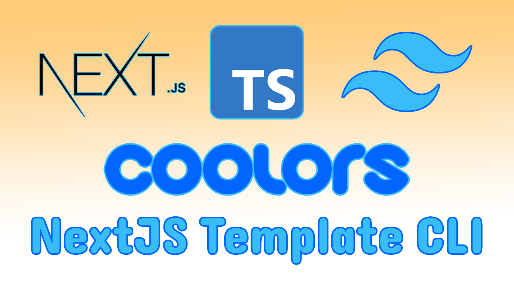

# NextJS Template CLI

NextJS Template CLI is a powerful starter booster project designed to help you kickstart your new web application ideas quickly and efficiently. With a robust set of features and optimizations, this CLI tool provides a solid foundation for building modern, high-performance websites using NextJS 14, TypeScript, and Tailwind CSS.



## Core Features

🚀 **NextJS 14 with App Directory, Server Components, and Layout Optimizations**
Harness the full potential of NextJS 14 with its cutting-edge features. The App Directory architecture enables better organization and performance, while Server Components allow for seamless server-side rendering. Enjoy optimized layouts for a smooth and efficient development experience.

🎨 **Tailwind CSS for Streamlined Styling**
Leverage the power of Tailwind CSS to rapidly build beautiful and responsive user interfaces. With its utility-first approach, you can create custom designs effortlessly, saving time and ensuring consistency across your application.

🌈 **Coolors.co Integration for Effortless Color Scheme Customization**
Easily personalize your application's color scheme using the Coolors.co integration. Simply provide a Coolors.co link, and watch as your chosen palette is seamlessly applied throughout your project, including the tailwind configuration, next configuration, and even the favicon.

🧩 **TypeScript for Enhanced Code Quality and Scalability**
Embrace the benefits of TypeScript to write type-safe and maintainable code. Catch potential errors early in the development process and enjoy improved code intelligence and refactoring capabilities.

🍬 **Fully Functional Navbar and Site Menu Options**
Choose from two meticulously crafted navbar and site menu configurations that are ready to use right out of the box. These fully functional components provide a professional and intuitive navigation experience for your users.

🎭 **SVG Logo and Favicon Support**
Make your application truly yours by easily incorporating your own branding assets. The CLI supports SVG logos and favicons, ensuring that your application reflects your unique identity across all devices and platforms.

🏗️ **Automated Configuration and Setup**
Save time and focus on what matters most—building your application. The NextJS Template CLI takes care of the initial configuration for essential files such as `tailwind.config.cjs`, `next.config.js`, `package.json`, `.vscode`, `postcss.config.js`, and `next-env.d.ts`. It also installs the necessary packages using Yarn, providing a hassle-free setup process.

🎨 **Convenient Color Scheme Updates**
Changing your application's color scheme is a breeze with the built-in `yarn update-colors` script. Simply provide a Coolors.co link, and watch as your chosen color palette is seamlessly applied throughout your project.

🎨 **Custom Logo and Colorization**

NextJS Template CLI now supports custom logo integration and automatic colorization using SVGRepo.com and Coolors.co. You can easily incorporate your own branding by selecting an SVG icon from SVGRepo.com or providing a custom URL during the project creation process.

The selected logo will be automatically colorized based on the chosen color scheme from Coolors.co, ensuring a cohesive visual identity for your project. You can preview the colorized logo before finalizing your choices, and even regenerate the SVG icon with new attributes (image, color scheme, or color order) until you're satisfied with the result.

To customize your project's logo:

1. During the project creation process, you will be prompted to select an SVG icon from SVGRepo.com or enter a custom URL.
2. Choose an icon from the provided options or enter a valid SVGRepo.com URL.
3. The CLI will fetch the selected SVG icon and generate an image preview for you to review.
4. If you want to make changes, you can regenerate the SVG icon with new attributes until you're happy with the result.
5. Once you confirm your choices, the custom logo will be integrated into your project, and the favicon and logo component will be updated accordingly.

Enjoy the flexibility and convenience of incorporating your own branding seamlessly into your NextJS projects!

## Getting Started

1. Clone the repository into your current working directory

```
git clone https://github.com/tsmith165/nextjs-template-cli.git
```

2. Navigate to cloned project directory

```
cd nextjs-template-cli
```

3. Install dependencies

```
yarn install
```

4. Build the project

```
yarn build
```

5. Create a new project using the CLI:

```
yarn start init my-awesome-project
```

 6. Follow the prompts to customize your project's configuration, such as choosing a color scheme and navbar style. 7. Once the project is generated, navigate to the project directory:

```
cd my-awesome-project
```

8. Start the development server:

```
yarn dev
```

9. Open your browser and visit http://localhost:3000 to see your new NextJS application in action!


## Customization and Development

The NextJS Template CLI provides a solid foundation for your project, but the real magic happens when you start customizing and building upon it. Dive into the codebase and explore the various components, pages, and configurations. Modify the styles, add new features, and make the application truly yours.

Remember to leverage the power of TypeScript and Tailwind CSS to create maintainable, efficient, and visually stunning code. The CLI sets you up for success, but the rest is up to you!

## 🎨 Updating Theme (Color Scheme and Logo)

NextJS Template CLI provides a convenient way to update your project's theme, including the color scheme and logo, using the `yarn update-theme` script. This script consolidates the functionality of the previous `yarn update-colors` and `yarn update-icons` scripts, providing a more streamlined theme update process.

To update your project's theme:

1. Make sure you are in the root directory of your generated project.
2. Run the following command:

That's it! Your project's color scheme will now reflect the selected color palette. You can run the development server to see the updated colors in action.


## Contributing

We welcome contributions from the community! If you have any ideas, suggestions, or bug reports, please open an issue on the GitHub repository. If you'd like to contribute code, feel free to submit a pull request.

## License

This project is licensed under the MIT License.

Happy coding, and may your web application ideas come to life with NextJS Template CLI! 🌟
